# 검증 보고: 안경 3D 품질 · 얼굴 관통 (2026-09-08)

실착용 테스트에서 보고된 두 문제 — ① 안경 모델 품질·"다리가 중간에 끊어짐", ② 안경이 얼굴을 뚫고 들어감 — 의 원인·수정·검증 기록. 설계: [`docs/superpowers/specs/2026-09-08-glasses-quality-and-clearance-design.md`](../superpowers/specs/2026-09-08-glasses-quality-and-clearance-design.md).

## 1. 원인 (Blender 재현)

정규 얼굴 모델 + 기존 GLB(FR-0001)를 런타임과 같은 배치(브릿지 = 랜드마크 6 + 1 mm, 다리 벌림 8.0°)로 올린 결과.

| 증상 | 측정 | 원인 |
|---|---|---|
| 다리 끊김 (먼 쪽) | yaw 20°에서 −X 다리 s=20~60 mm 구간은 얼굴 메시 뒤, s ≥ 77 mm는 실루엣 **밖** | 얼굴 메시에 두개골·귀가 없고 머리 타원체(반폭 68 mm)가 다리 x(79~83 mm)보다 좁아 귀 뒤 구간이 떠서 보임 |
| 다리 끊김 (가까운 쪽) | 다리 ↔ 관자놀이 정점 162 최소 부호 거리 **−0.98 mm** | 벌림 솔버가 127/234 두 점만 검사, 다리 높이의 최대 폭 정점(162)을 놓침 |
| 다리 형태 | 55 %(77 mm) 지점부터 처짐 | 귀 앞(234)이 힌지에서 85 mm, 귓바퀴 상단 ~100 mm — 귀보다 앞에서 굽음 |
| 얼굴 관통 | 프레임 −1.53 mm, 코 패드 −2.28 mm (정규 모델) | 림 뒷면·패드 대 눈썹·볼·코 검사 없음 |
| 모델 품질 | 림·브릿지·다리 모두 Ø2~3 mm 원형 튜브 | 절차적 TubeGeometry |

| 수정 전 (정면) | 수정 전 (yaw 35°) | 수정 전 (측면) |
|---|---|---|
| 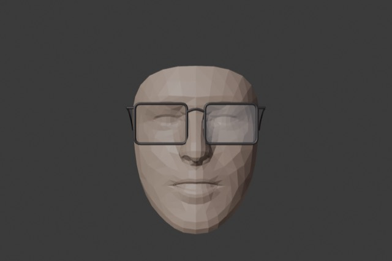 | 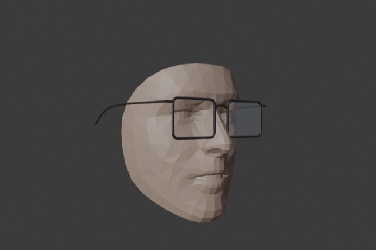 | 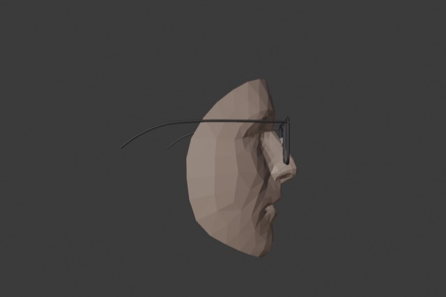 |

## 2. 수정

1. **안경 3종 Blender 파라메트릭 모델링** (`scripts/blender/frame_builder.py`, 정의 `scripts/frames.json`): 납작한 림 단면 스윕(아세테이트 4.5 × 4, 메탈 1.8 × 2.2), 4베이스 구면 렌즈, 브릿지 아치(보잉은 이중), 엔드피스 블록/힌지 배럴, 힌지에서 95~99 mm 직선 후 귀 뒤로 28 mm 굽는 테이퍼 다리, 코 패드(일체형 범프 / 패드암 + 타원 패드). 폭·렌즈 폭 오차 0.00~0.04 mm, 2.5~2.9만 삼각형, 0.45~0.52 MB. 원점 = 코 패드 접촉면, 렌즈 평면은 그 앞 7 mm.
2. **두개골 + 귀 오클루더** (`scripts/blender/head_builder.py` → `public/models/head_occluder.glb`): 정규 얼굴보다 최소 2.6 mm 뒤(레이 검사), 런타임에서 귀 높이 반폭이 다리 x − 2 mm가 되도록 X 스케일 → 먼 쪽 다리는 숨고 가까운 쪽은 보임.
3. **클리어런스 솔버** (`src/core/fitting/clearance.ts`): 옆면 정점 띠(|x| > 50, 다리 높이 ±15 mm)로 다리 벌림, 림 뒷면(림 폭만큼 키운 렌즈 외곽선 24점/렌즈) · 브릿지 바 · 코 패드 프로브를 눈썹·볼·코 높이장과 비교해 전방 보정, 보정 후 관통 잔여(mm)를 HUD `관통 잔여` / CSV로 출력. 앵커·전방 보정·벌림은 One-Euro로 평활.
4. **팬토스코픽 틸트 8°** — 프런트만 기울이고 다리는 힌지에서 `Rx(−tilt)`로 수평 유지(`glasses.ts`).
5. **얼굴 변형 벤치** — 14종(폭·길이·깊이·코 높이·광대·눈썹·관자놀이 폭 조합) × 5 포즈 × 3 프레임 = 210 케이스. `tests/core/clearance.test.ts` 회귀 + `npm run bench:fit` + Blender `fit_bench.py`(실제 GLB 메시 대 오클루더 메시 BVH 판정·렌더).

| 수정 후 FR-0001 (yaw 35°) | FR-0001 근접 | FR-0002 근접 | FR-0003 근접 |
|---|---|---|---|
|  | 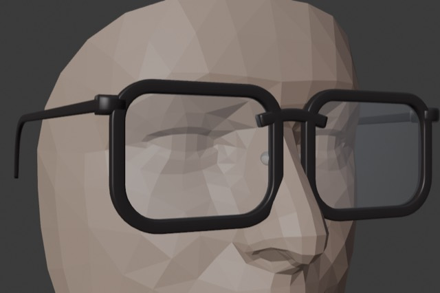 | 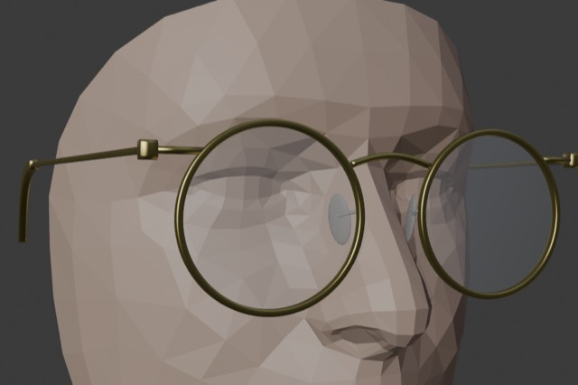 | 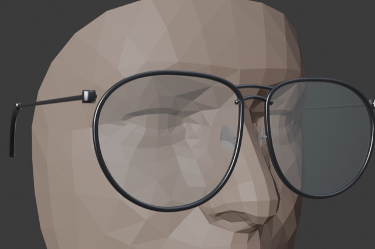 |

| 머리 오클루더 (yaw 35°) | 머리 오클루더 (측면) |
|---|---|
| 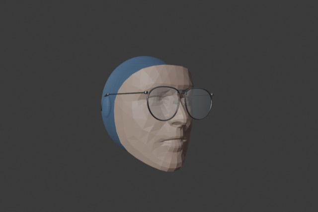 | 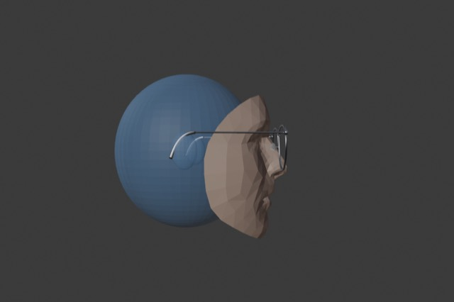 |

## 3. 결과

### 3.1 코어 회귀 (`npm test`, `npm run bench:fit`)

- 12 파일 / 81 테스트 통과, 골든 벡터 재생성.
- 210 케이스 관통 잔여(보정 후): 다리 −2.50, 눈썹 ≤ −20, 볼 ≤ −16.8, 코 −1.50 mm — **모두 ≤ 0**.
- 전방 보정 최대 10.8 mm(FR-0001, short·pitch −15), FR-0002 3.4 mm, FR-0003 9.5 mm. 다리 벌림 3.2~14.0°(한도 15°).
- `DEPTH=landmark`(랜드마크 깊이) 모드: 최대 10.5 mm, 포즈에 따른 전방 보정 변동이 작아짐(최악 케이스가 대부분 정면).

### 3.2 Blender 실메시 판정 (`fit_bench.py`)

210 케이스, 오클루더(메트릭) 메시 기준 — 다리 ≥ −0.5, 림 ≥ −0.5, 렌즈 ≥ 0, 패드 ≥ −1.5 mm.

- **210/210 통과.** 오클루더 메시 기준 최소 부호 거리: 프레임 +1.16, 렌즈 +4.9, 코 패드 +0.32, 다리 +0.86 mm (모두 양수 = 표면 밖). 실제 변형 얼굴 기준(참고): 프레임 −0.37, 패드 −0.70, 다리 −0.21 mm — 깊이 불일치에 의한 1 mm 미만 오차.
- 렌더(`bench/renders/`, 아래는 일부): 정면·yaw 32°.

| canonical 정면 | canonical yaw 32° | flat(납작·코 낮음) 정면 |
|---|---|---|
| 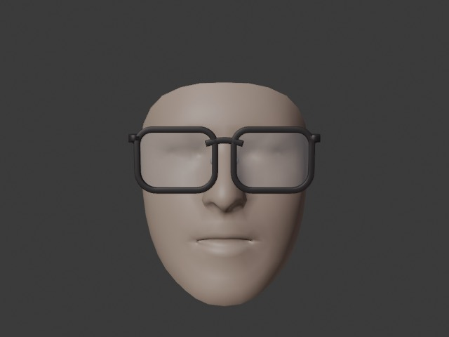 | 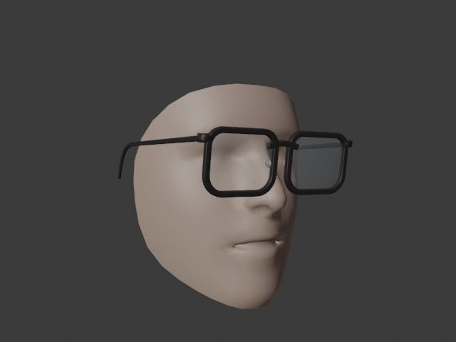 | 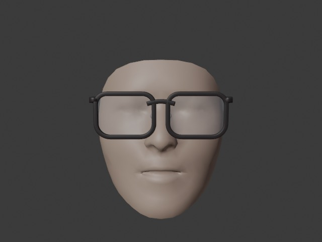 |

| wide_flat yaw 32° | extreme yaw 32° | narrow_high 정면 |
|---|---|---|
| 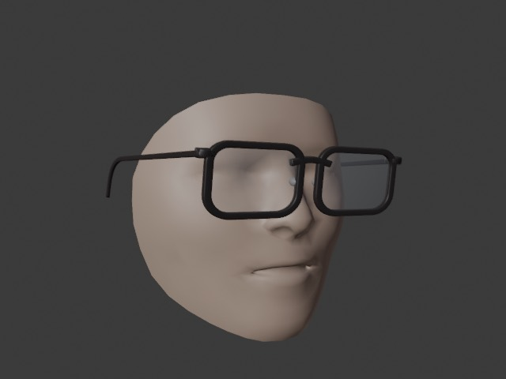 | 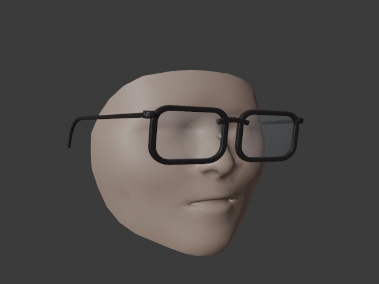 | 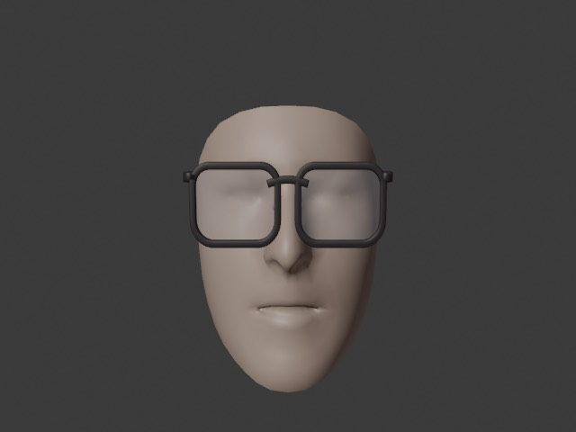 |

### 3.3 브라우저 (dev 서버, 합성 재생 `?replay=/bench/replays/<variant>-<pose>.json`)

- 새 GLB 로드: 에셋 검수 `glb · 폭 138.0/138 mm · 24612 tris`, 머리 오클루더 GLB 로드(콘솔 경고 없음).
- canonical yaw 30°: 관통 잔여 −2.5 / −22.6 / −22.8 / −1.5, 전방 보정 10.0, 벌림 7.3°/7.3° — 먼 쪽 다리는 힌지 부근만 보이고 귀 뒤 구간은 두개골 프록시에 가려짐.
- extreme(폭 1.15·납작·광대·관자놀이 +6) 정면: 폭 스케일 1.25, 벌림 13.5°, 관통 잔여 모두 ≤ 0.

## 4. 남은 한계와 다음 단계

1. **정규 모델 코 높이**: 메트릭 깊이가 정규 모델이므로(실제, 특히 동아시아형보다 코가 높고 능선이 날카로움) 아세테이트 프레임의 안쪽 림이 코 옆면을 파고들어 ~10 mm 전방 보정이 생긴다. 관통은 없지만 3/4 뷰에서 프레임이 얼굴 앞에 떠 보일 수 있다. 실기기에서 HUD `깊이: 랜드마크 z 사용`을 켜면 개인 코 깊이가 반영된다 — 랜드마크 z의 흔들림이 허용 범위인지 W1에서 판단.
2. 조절식 코 패드는 정규 코에서 옆면에 닿지 않고 4~5 mm 떠 있다(코 능선이 얇아 접촉·브릿지 간섭이 동시에 만족되지 않음). 2D 오버레이에서는 보이지 않으나, 랜드마크 깊이 모드에서 패드 접촉 착지(패드 간격 = 코 폭 높이)를 본 개발에서 구현.
3. 얼굴 메시가 귀 앞(z ≈ −25)에서 끝나므로 그 뒤 다리는 프록시로만 가려진다. 실제 귀 위치·머리 폭은 추정값(다리 x − 2 mm)이다.
4. 렌더 품질(재질·환경광)은 판정 대상이 아니며, Workbench 렌더는 형태 확인용이다.
