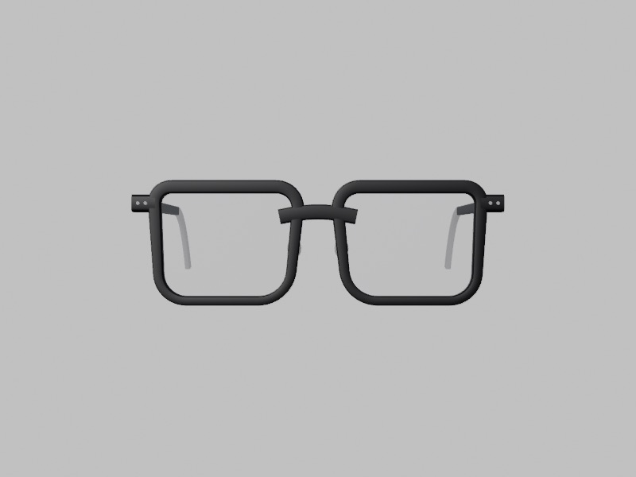
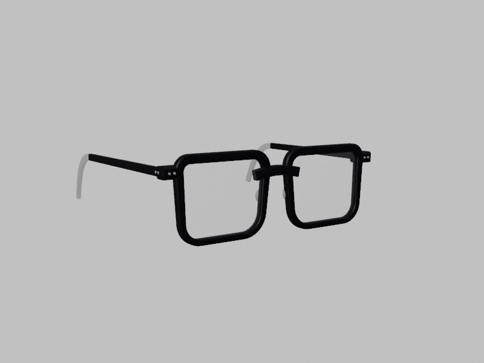
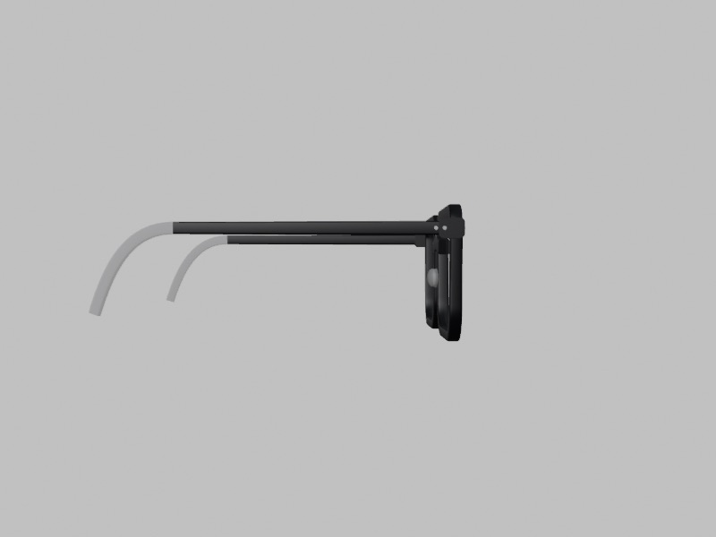
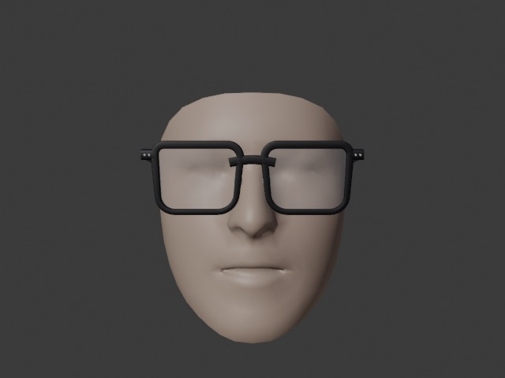
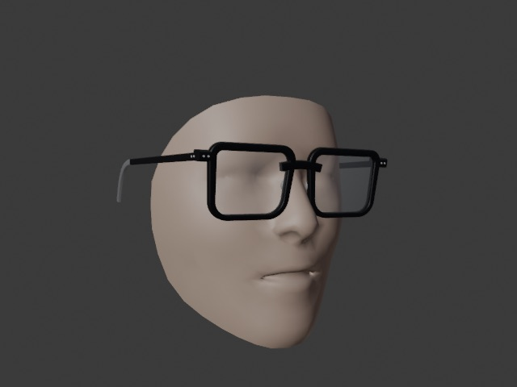
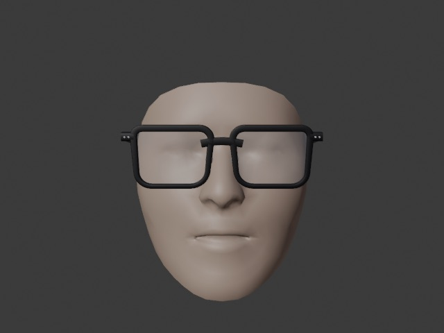
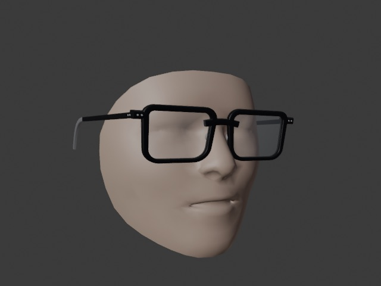
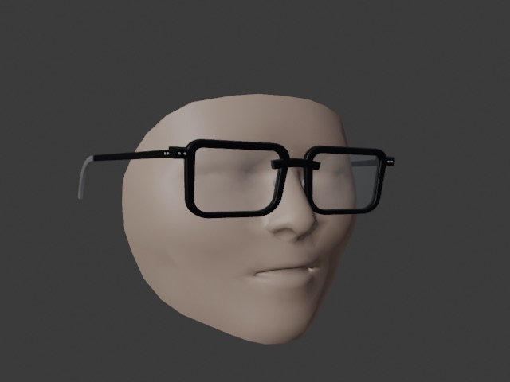

# 검증 보고: 안경 부유(얼굴 앞에 떠 보임) 수정 · 단일 제품 프레임 (2026-09-08)

두 번째 실착용 테스트(정면·yaw ±60°·측면 사진 3장)에서 **안경이 얼굴 앞에 떠 보이는** 문제가 재보고됐다. 이 문서는 원인 계측, 수정, 합성·Blender·브라우저 검증 기록이다. 첫 보고서: [`2026-09-08-fit-bench.md`](2026-09-08-fit-bench.md).

같은 작업에서 제품 프레임을 **한 종으로 교체**했다: 전면 148 · 렌즈 52 × 41 · 브릿지 21 · 다리 145 mm, 검정 아세테이트 웰링턴(사각) — 참고 사진의 형태(납작한 굵은 상단 림, 새들 브릿지, 엔드피스 리벳, 투명 다리 팁). 정의는 `scripts/frames.json` 한 항목이며 mock API도 이 한 종만 서비스한다.

## 1. 원인 계측

기존 파이프라인(FR-0001 138 mm, 정규 모델 깊이)을 `bench/probe-current.ts`로 계측한 값(얼굴 로컬 mm, +Z = 카메라 쪽):

| 단계 | 값 | 의미 |
|---|---|---|
| 코 착지(`solveNoseLanding`) | 원점 z = **58.9** (랜드마크 6의 능선 z 57.9 + 1 mm) | 브릿지 바를 콧대 능선 *위*에 놓는다 |
| 클리어런스 전방 보정 | **+10.0 mm** | 림 안쪽 아래 모서리(예: (−6.7, 3.8))가 정규 모델 코 옆면(z 67.5)에 8.5 mm 파고들어 통째로 앞으로 민다 |
| 최종 원점 / 렌즈 평면 | z 68.9 / 75.9 | 정규 모델 코끝(z 74.8)보다 **앞** |
| 정점간 거리(렌즈 뒷면–각막) | **34.6 mm** | 실제 안경 12~15 mm의 2배 이상 → 옆·3/4에서 떠 보임 |
| 납작한 얼굴 변형(flat), 정규 깊이 | 착지 z 58.9(정면) → 57.4(yaw 30) → 54.5(yaw 60) | 화면 xy는 실제, 깊이는 정규 모델이라 **고개를 돌리면 프레임이 4 mm 미끄러진다** |

즉 원인은 세 가지가 겹친 것이다. ① 착지 기준이 코 패드가 아니라 능선이라 처음부터 5~8 mm 앞에 있고, ② 림 뒷면 전체를 코 높이장과 비교해 정규 모델의 **넓은 콧등**(실제 코보다 옆면이 3~4 mm 앞에 있음)에 맞춰 10 mm를 더 밀며, ③ 렌즈 평면이 원점보다 7 mm 앞이라 합이 20 mm를 넘었다. 정면에서는 이 깊이 오차가 "프레임이 커 보이고(원근) 살짝 아래로 내려감(pitch)"으로만 나타나 눈치채기 어렵고, 옆에서 그대로 드러난다.

## 2. 수정

| 항목 | 내용 | 파일 |
|---|---|---|
| 착지 = **코 패드 접촉** | 에셋의 패드 접촉점(`nose_pad_offset`, x ≠ 0)을 코 옆면 높이장에 얹어 원점 깊이를 정한다(`padSinkMm` 만큼 가라앉음). 능선 + 여유는 패드 정보가 없을 때의 폴백 | `src/core/fitting/noseLanding.ts` |
| 얼굴 표면 = **삼각형 높이장** | 정규 삼각분할 중 영역(코·눈썹·볼) 삼각형을 모듈 로드 시 고르고, 사용자 메트릭 점 위에서 무게중심 보간. 3-최근접 역거리 가중 대체 | `src/core/fitting/faceSurface.ts` |
| 림 프로브 = **제품 림 외곽선** | mock API `assets.anchor.rim_outline_mm`(+X 림 바깥 경계 48점, `rim_back_mm` 깊이)를 그대로 프로브. JS(`scripts/lib/lens-outline.mjs`)와 Blender가 같은 외곽선을 만들고 `gen-frames`가 편차 0.6 mm 이내를 검사한다(현재 0.00) | `clearance.ts`, `scripts/lib/*`, `frame_builder.py` |
| 코 옆면 허용 침하 | 림 안쪽 면은 코 옆면에 `noseSinkMm` = 2 mm까지 가라앉을 수 있다(실제 프레임도 콧등 옆에 자국이 남는 접촉 부위) | `config.ts` |
| **정점간 거리 클램프** | 눈꺼풀 랜드마크로 각막 위치를 잡고 렌즈 뒷면–각막 거리를 `vertexMinMm..vertexMaxMm` = 10..23 mm로 제한. 어떤 입력이든 이 밖으로 떠오르거나 눈에 붙지 못한다. 결과는 `clearance.vertexMm`, 패드 간격은 `padGapMm`으로 HUD·CSV에 나온다 | `clearance.ts`, `panel.ts`, `app.ts` |
| 깊이 출처 **하이브리드**(기본) | 눈·눈썹·볼·옆면은 정규 모델 깊이, **코 영역만 MediaPipe 랜드마크 z**(눈 기준으로 정렬)로 개인 코 높이를 반영. 정규 깊이 / 랜드마크 z 전체는 HUD 선택으로 남김 | `metricLandmarks.ts` |
| 고정 패드의 세로 위치 | 브릿지 폭에 따른 미끄러짐 규칙은 조절식 패드에만 적용(고정 패드는 접촉점이 정해져 있음) → 동공이 렌즈 중심보다 3.6 mm 위 | `noseLanding.ts` |
| 새 프레임 모델 | 웰링턴 외곽선(모서리 반경 4/6/11/9, 안쪽 변 3.5 mm 경사), 림 폭 5.2 → 3.8 mm 테이퍼, 6 mm 새들 브릿지, 7 mm 엔드피스 + 리벳, 100 mm 직선 후 30 mm 하강하는 다리와 45 mm 투명 팁, 25° 벌어진 일체형 패드. 예리한 모서리(20° 이상)는 분할 법선으로 내보내 납작한 아세테이트로 보인다 | `scripts/frames.json`, `frame_builder.py` |

| 프레임 정면 | 3/4 | 측면 |
|---|---|---|
|  |  |  |

## 3. 결과

### 3.1 코어 (`npm test`, `npm run bench:fit`)

- 14 파일 / 91 테스트 통과(신규: `faceSurface`, `depthSource`(하이브리드), 패드 접촉 착지, 림 외곽선 프로브, 정점 클램프, 코 침하 허용, 브릿지 여유). 골든 벡터 재생성.
- 얼굴 변형 14종 × 포즈 5종 × 프레임 1종 = 70 케이스(하이브리드 깊이): **정점간 거리 15.9~23.0 mm**(수정 전 27~35), 전방 보정 ≤ 8.0 mm, 다리 벌림 0.4~9.7°, 관통 잔여 다리 −2.5 / 눈썹 ≤ −4.1 / 볼 ≤ −2.5 mm. 코는 정점 상한(23)에 걸린 변형(정규·high_nose·short 등, 정규 모델 계열의 넓은 콧등)에서 +2.5 mm까지 남고, flat·wide_flat·extreme·high_cheek 등은 −1.0(허용치 안).
- 하이브리드 모드에서는 flat 변형의 착지 깊이가 yaw 0/30/60에서 45.9 / 46.6 / 48.0 mm로, 정규 깊이 모드의 4 mm 미끄러짐이 2 mm 이내로 준다.

### 3.2 Blender 실메시 판정 (`fit_bench.py`)

70/70 통과(허용: 다리 ≥ −0.5, 림 ≥ −3.0, 렌즈 ≥ 0, 패드 ≥ −2.0 mm). 오클루더(메트릭) 메시 기준 최소 부호 거리: 림 **−1.84**, 패드 −0.50, 다리 +0.81, 렌즈 +2.35 mm. 코어의 "코 잔여 +2.5"는 z 방향 간격이고, 가파른 코 옆면에서 법선 거리로는 1.8 mm다.

| canonical 정면 | canonical yaw 32° | flat yaw 32° |
|---|---|---|
|  |  |  |

| flat 정면 | wide_flat yaw 32° | extreme yaw 32° |
|---|---|---|
|  |  |  |

수정 전 3/4 렌더(`images/new_FR-0001_34.jpg`)에서는 프레임 앞면이 코끝 앞에 있었다. 지금은 브릿지가 콧대 위, 렌즈가 눈 앞 20 mm 안쪽에 있고 먼 쪽 림이 코에 정상적으로 가려진다.

### 3.3 브라우저 (dev 서버, 합성 재생)

- 에셋 검수 `glb · 폭 148.0/148 mm · 29069 tris`, 머리 오클루더 GLB, 콘솔 오류 없음.
- `?replay=/bench/replays/canonical-front.json`: 정점간 거리 23.0, 패드 간격 6.0, 전방 보정 7.0, 관통 잔여 −2.5 / −10.1 / −11.8 / −0.2, 벌림 5.2°.
- `?replay=/bench/replays/flat-yaw30.json`: 정점간 거리 17.8, 관통 잔여 −2.5 / −7.0 / −5.9 / −1.0, 벌림 4.3° / 6.3°.

## 4. 남은 한계 · 실기기에서 할 일

1. **정규 모델 계열 얼굴은 여전히 상한(23 mm)에 닿는다.** 정규 모델의 콧등이 실제보다 넓어 림 안쪽이 옆면에 걸리기 때문이다. 하이브리드 깊이에서는 사용자의 MediaPipe 코 굴곡이 대신 쓰이므로 실제 얼굴에서는 달라진다 — **MediaPipe z의 굴곡 크기가 실제와 얼마나 다른지**가 남은 미지수다(작게 나오면 프레임이 눈에 가깝게, 크게 나오면 살짝 앞에 놓인다; 클램프가 10~23 mm 안에 묶는다).
2. 실기기 확인 순서: HUD `정점간 거리 / 패드 간격`이 12~20 / 0~3 mm 근처인지, `관통 잔여`가 모두 ≤ 0인지, 옆모습에서 브릿지·패드가 콧대에 붙는지. `얼굴 깊이 출처`를 하이브리드 ↔ 정규 모델 ↔ 랜드마크 z로 바꿔 비교한다.
3. **녹화 요청**: HUD "녹화 시작" → 정면 3초 → 좌우 yaw 60°까지 천천히 → 옆모습 → "녹화 정지" → "녹화 저장(JSON)". 이 파일을 재생하면 카메라 없이 같은 얼굴로 깊이 출처·클램프·패드 위치를 오프라인에서 맞출 수 있다(재생에는 영상이 없고 랜드마크만 있으므로 개인정보는 좌표뿐이다).
4. 정면 사진에서 프레임이 커 보이던 것(원근)과 아래로 내려가 보이던 것(pitch)은 깊이 20 mm 오차의 부산물이라 함께 줄어야 한다. 폭 비율 보정(`widthScaleEnabled`)은 그대로 켜져 있다.
